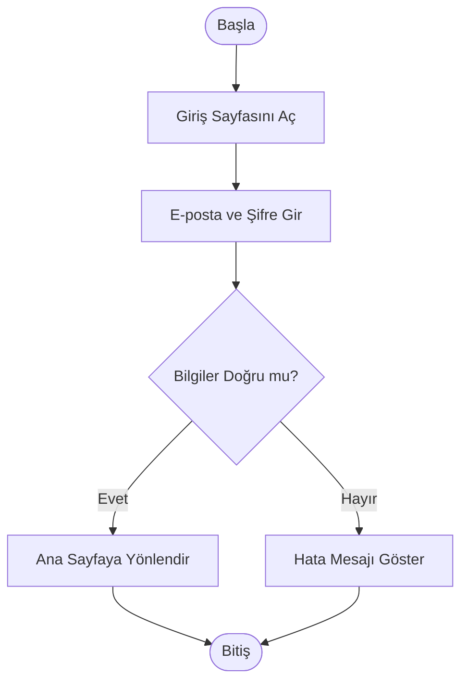
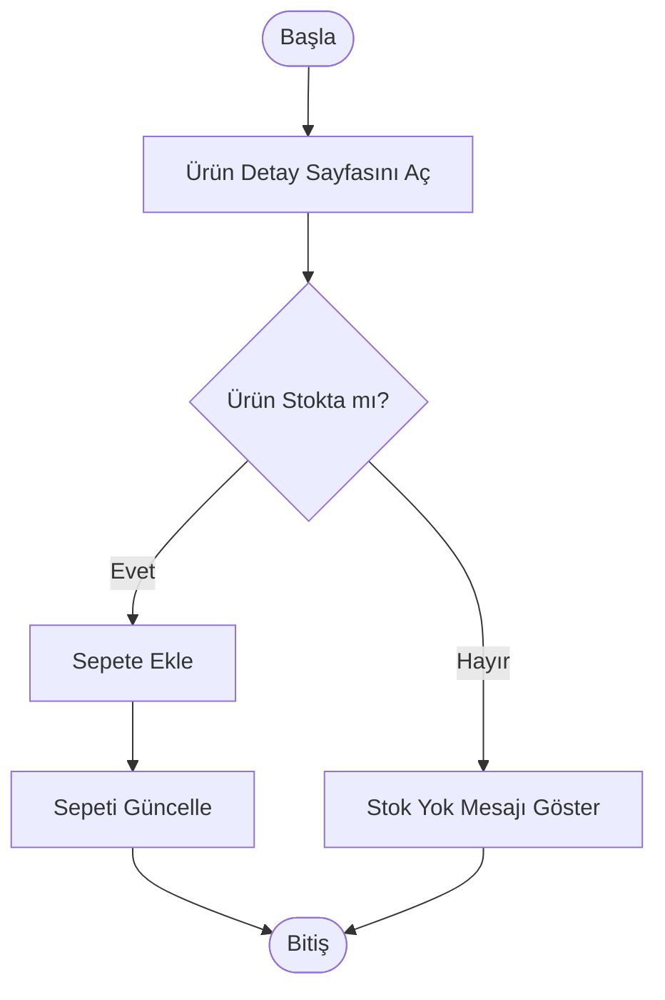
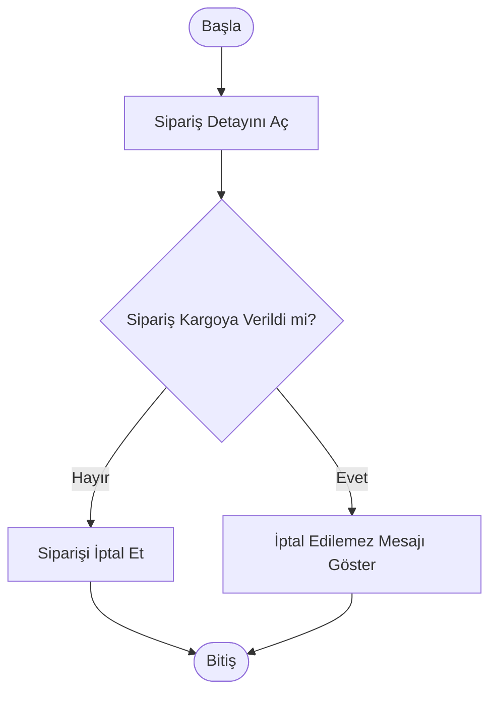

# Activity Diagrams

## Amaç

Bu doküman, ShopSphere E-Ticaret Sipariş ve Ödeme Yönetim Sistemi'nin temel iş süreçlerini Activity Diagram ile göstermektedir.

---

# 1. Kullanıcı Giriş Yapma

---

# 2. Ürünü Sepete Ekleme

---

# 3. Sipariş İptali

---

## Açıklama

Bu aktivite diyagramları, sistemde sık kullanılan temel kullanıcı işlemlerini göstermektedir. Süreçlerdeki karar noktaları ve olası senaryolar görsel olarak ifade edilmiştir.
