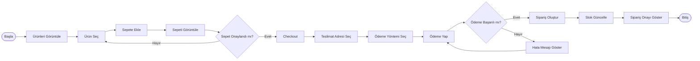

# BPMN - Sipariş Süreci

## Amaç

Bu doküman, müşterinin ürün seçmesinden siparişin oluşturulmasına kadar olan temel sipariş sürecini göstermektedir.

---

## Süreç Akışı

---

## Süreç Açıklaması

1. Müşteri ürünleri görüntüler ve satın almak istediği ürünü seçer.
2. Ürün alışveriş sepetine eklenir.
3. Müşteri sepeti onayladıktan sonra ödeme adımına geçer.
4. Teslimat adresi ve ödeme yöntemi seçilir.
5. Ödeme başarılı olursa sipariş oluşturulur ve stok güncellenir.
6. Sipariş onayı müşteriye gösterilir.
7. Ödeme başarısız olursa kullanıcı tekrar ödeme yapabilir.
