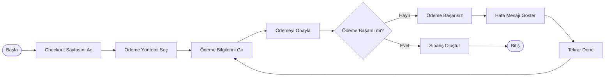

# BPMN - Ödeme Süreci

## Amaç

Bu doküman, müşterinin ödeme yöntemini seçmesinden siparişin oluşturulmasına kadar olan ödeme sürecini göstermektedir.

---

## Süreç Akışı

---

## Süreç Açıklaması

1. Müşteri checkout sayfasına geçer.
2. Ödeme yöntemini seçer.
3. Ödeme bilgilerini girer ve işlemi onaylar.
4. Sistem ödeme sonucunu kontrol eder.
5. Ödeme başarılı ise sipariş oluşturulur.
6. Ödeme başarısız ise kullanıcıya hata mesajı gösterilir ve tekrar ödeme yapması istenir.
