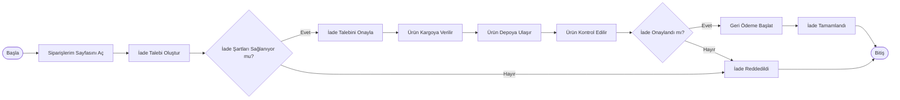

# BPMN - İade Süreci

## Amaç

Bu doküman, müşterinin teslim aldığı bir ürün için iade talebi oluşturmasından geri ödeme sürecinin tamamlanmasına kadar olan iş akışını göstermektedir.

---

## Süreç Akışı

---

## Süreç Açıklaması

1. Müşteri, siparişleri arasından iade etmek istediği ürünü seçer.
2. Sistem, ürünün iade koşullarını kontrol eder.
3. Koşullar uygunsa iade talebi oluşturulur.
4. Müşteri ürünü kargoya teslim eder.
5. Ürün depoya ulaştıktan sonra kontrol edilir.
6. Kontrol sonucunda iade onaylanırsa geri ödeme başlatılır.
7. İade koşulları sağlanmıyorsa veya ürün kontrolden geçemezse talep reddedilir.
