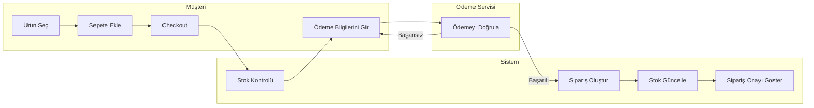

# Swimlane Diagrams

## Amaç

Bu doküman, ShopSphere E-Ticaret Sipariş ve Ödeme Yönetim Sistemi'nde sipariş oluşturma sürecini aktör bazlı (Swimlane) göstermektedir.

---

## Sipariş ve Ödeme Süreci

---

## Açıklama

* **Müşteri**, ürün seçimi, sepet işlemleri ve ödeme bilgilerini girme adımlarını gerçekleştirir.
* **Sistem**, stok kontrolünü yapar, siparişi oluşturur ve stok bilgilerini günceller.
* **Ödeme Servisi**, ödeme işlemini doğrular ve sonucu sisteme iletir.
* Ödeme başarısız olursa müşteri ödeme bilgilerini tekrar girebilir.
* Ödeme başarılı olduğunda sipariş tamamlanır ve müşteriye sipariş onayı gösterilir.
