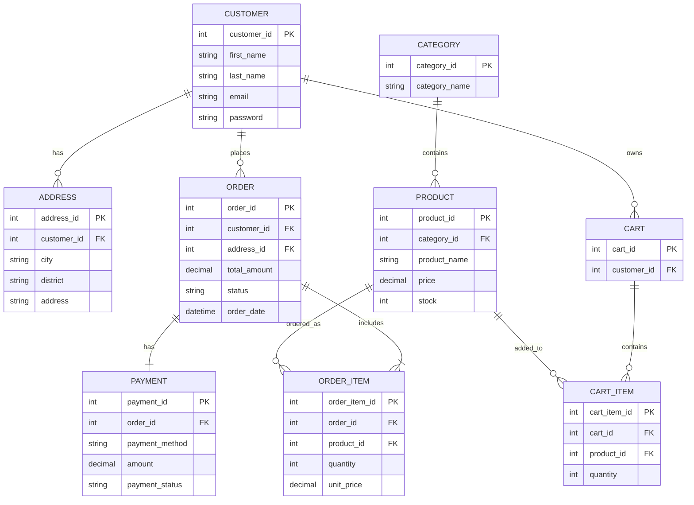

# ER Diagram

## Amaç

Bu doküman, ShopSphere E-Ticaret Sipariş ve Ödeme Yönetim Sistemi'nin temel veritabanı yapısını göstermektedir.

---

## ER Diyagramı

---

## Açıklama

Bu ER diyagramı, ShopSphere sisteminin temel veri modelini göstermektedir.

* **CUSTOMER** müşteri bilgilerini tutar.
* **ADDRESS** müşteriye ait teslimat adreslerini saklar.
* **CATEGORY** ürün kategorilerini içerir.
* **PRODUCT** satışa sunulan ürünleri ve stok bilgilerini tutar.
* **CART** müşterinin aktif alışveriş sepetini temsil eder.
* **CART_ITEM** sepette bulunan ürünleri saklar.
* **ORDER** oluşturulan siparişleri içerir.
* **ORDER_ITEM** siparişte yer alan ürünleri saklar.
* **PAYMENT** siparişe ait ödeme bilgilerini içerir.

Bu veri modeli, sistemin temel sipariş ve ödeme süreçlerini destekleyecek şekilde tasarlanmıştır.
